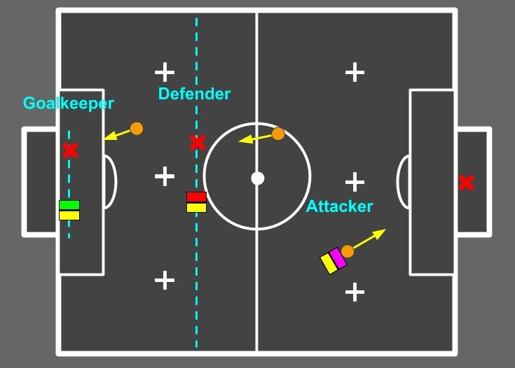
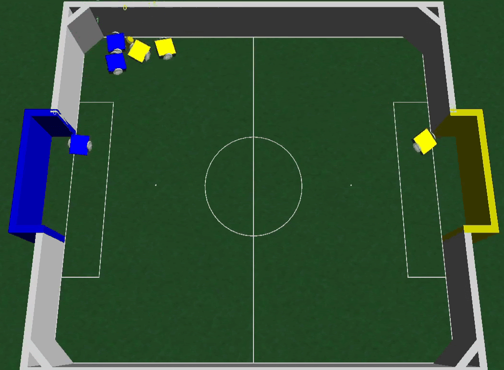
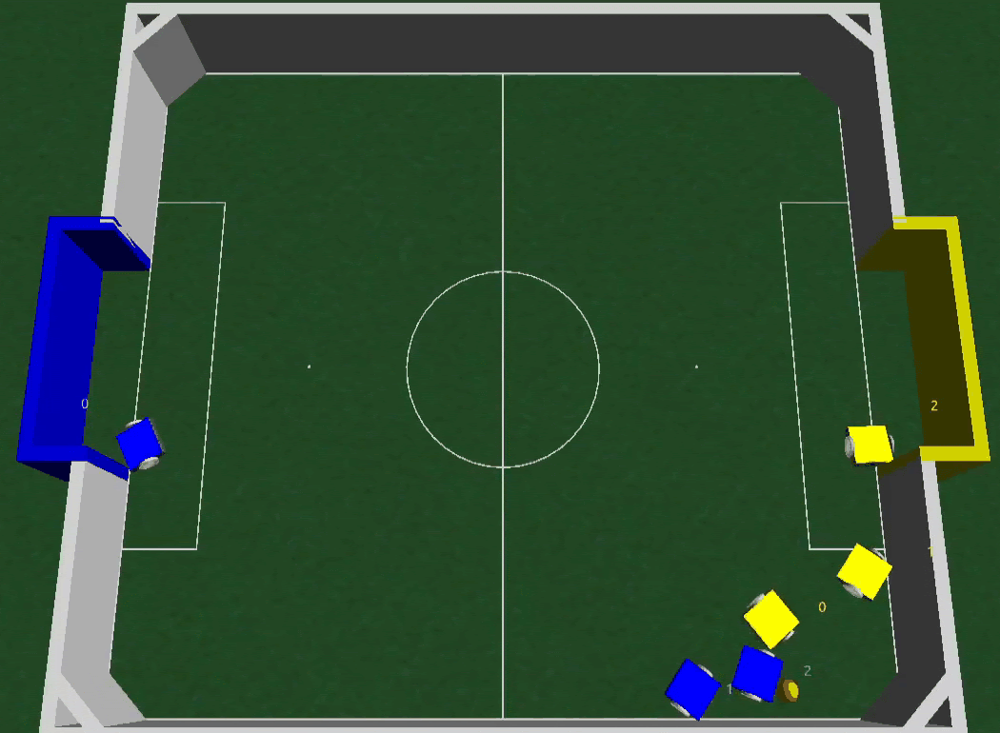

# Coach-RL

Repository of the paper [An analysis of Reinforcement Learning applied to Coach task in IEEE Very Small Size Soccer](https://arxiv.org/abs/2011.11785) to be published in Latin American Robotics Symposium 2020

This project analyze the match situation and choose the best strategy that can be composed of a Goalkeeper, a defender, and an attacker.

Example of learned behaviors: efficient position switching

 

## Installation

- Install [FIRASim](https://github.com/robocin/FIRASim/blob/master/INSTALL.md)

- `git clone https://github.com/RC-Dynamics/Coach-RL.git`
- `pip install -e .`
- Build your vss-software
- Copy vss-software/src/Config to examples
- Copy your builded agent to gym_coach_vss/bin
- run examples/sample_coach.py

ps. CoachEnv takes as argument "sim_path". This argument indicates where 
your FIRASim binarie is. The default will take it as '/home/$USER/FIRASim/bin/FIRASim'.

## ToDo

- Instructons to the comunication protocol.
- Improve README 
